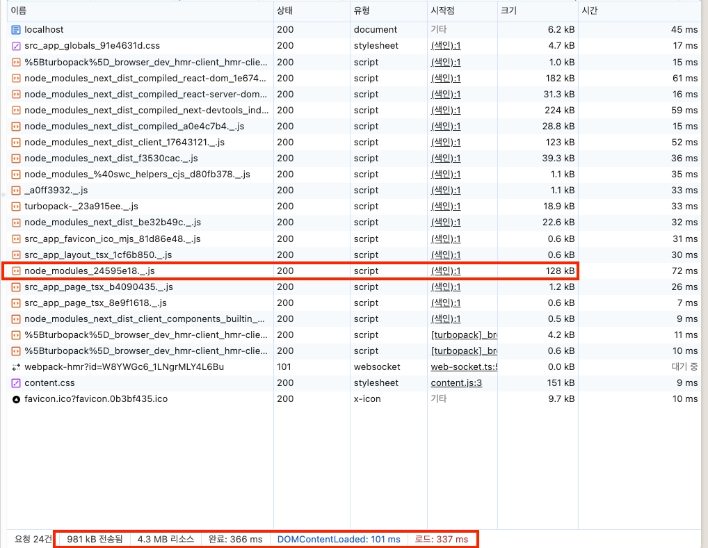
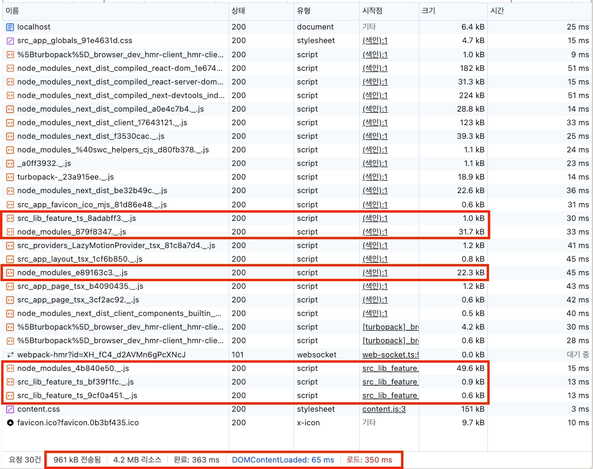

# 2026-02-24 학습 내용 정리

## 목차

1. [Framer Motion (애니메이션 라이브러리)](#1-framer-motion-애니메이션-라이브러리)
   - [initial / animate / transition](#initial--animate--transition)
   - [whileHover / whileTap](#whilehover--whiletap)
   - [useMotionValue](#usemotionvalue)
   - [useTransform](#usetransform)
   - [whileInView / useInView](#whileinview--useinview)
   - [useScroll](#usescroll)
   - [variants](#variants)
   - [layout (레이아웃 애니메이션)](#layout-레이아웃-애니메이션)
   - [exit / AnimatePresence](#exit--animatepresence)
2. [Framer Motion 최적화 (LazyMotion)](#2-framer-motion-최적화-lazymotion)
3. [Intersection Observer API](#3-intersection-observer-api)
4. [react-intersection-observer](#4-react-intersection-observer)

---

## 1. Framer Motion (애니메이션 라이브러리)

설치: `npm install motion`

### initial / animate / transition

- `motion` 컴포넌트의 가장 기본적인 애니메이션 prop
- `initial`: 컴포넌트가 **마운트될 때의 초기 상태**
- `animate`: 컴포넌트가 **마운트된 후 전환될 목표 상태**
- `transition`: 애니메이션의 **속도, 딜레이, 이징** 등 전환 방식 설정

```tsx
import { motion } from "motion/react";

// 기본 페이드 인
<motion.div
  initial={{ opacity: 0 }}
  animate={{ opacity: 1 }}
  transition={{ duration: 0.5 }}
>
  나타납니다
</motion.div>

// 위에서 아래로 슬라이드 인
<motion.div
  initial={{ opacity: 0, y: -50 }}
  animate={{ opacity: 1, y: 0 }}
  transition={{ duration: 0.4, ease: "easeOut" }}
>
  슬라이드 인
</motion.div>
```

#### transition 주요 옵션

| 옵션       | 설명                                                 |
| ---------- | ---------------------------------------------------- |
| `duration` | 애니메이션 지속 시간 (초 단위)                       |
| `delay`    | 애니메이션 시작 전 대기 시간 (초 단위)               |
| `ease`     | 이징 함수 (`"easeIn"`, `"easeOut"`, `"linear"` 등)   |
| `type`     | 애니메이션 종류 (`"tween"`, `"spring"`, `"inertia"`) |

> `initial`을 `false`로 설정하면 초기 애니메이션을 건너뛰고 바로 `animate` 상태로 시작

### whileHover / whileTap

- `whileHover`: 마우스를 **올렸을 때(hover)** 적용할 애니메이션 상태
- `whileTap`: 마우스를 **클릭하는 동안(tap)** 적용할 애니메이션 상태
- 별도의 state 없이 선언적으로 인터랙션 애니메이션을 처리할 수 있음
- 손을 떼거나 마우스가 벗어나면 자동으로 원래 상태로 돌아옴

```tsx
// app/components/QuestionPage/index.tsx
<motion.button
  initial={{ opacity: 0, y: 30 }}
  animate={{ opacity: 1, y: 0 }}
  transition={{ delay: index * 0.1, duration: 0.5 }}
  whileHover={{ scale: 1.02 }} // hover 시 살짝 커짐
  whileTap={{ scale: 0.98 }} // 클릭 시 살짝 작아짐
>
  {option}
</motion.button>
```

> `scale` 외에도 `opacity`, `rotate`, `backgroundColor` 등 다양한 속성 사용 가능

### useMotionValue

- React state와 달리 값이 바뀌어도 **리렌더링을 유발하지 않는** 특별한 값
- 애니메이션 중 실시간으로 변하는 값을 추적할 때 사용
- `animate()` 함수와 함께 쓰면 값을 부드럽게 변화시킬 수 있음

```tsx
import { animate } from "motion";
import { useMotionValue, motion } from "motion/react";
import { useEffect } from "react";

export default function Counter() {
  // motionValue 생성 (초기값 0)
  const motionValue = useMotionValue(0);

  useEffect(() => {
    // 0 → 100 으로 2초 동안 애니메이션
    const control = animate(motionValue, 100, { duration: 2 });
    return () => control.stop(); // 언마운트 시 정리
  }, [motionValue]);

  return (
    <div>
      {/* motion 컴포넌트에 motionValue를 직접 연결 */}
      <motion.pre>{motionValue}</motion.pre>
    </div>
  );
}
```

### useTransform

- **motionValue를 다른 값으로 변환**하는 훅
- 두 가지 방식으로 사용 가능:
  - **매핑 방식**: 입력 범위 → 출력 범위로 선형 변환
  - **콜백 방식**: 함수를 통해 자유롭게 변환

```tsx
import { useMotionValue, useTransform } from "motion/react";

const motionValue = useMotionValue(0);

// 콜백 방식: 소수점 없이 정수로 변환
const toFixed = useTransform(motionValue, (latest) => latest.toFixed(0));

// 매핑 방식: 스크롤 0~1 → clipPath 원 크기 변환
const clipPath = useTransform(scrollYProgress, (v) => `circle(${v * 100}%)`);
```

> `counter.tsx` 참고: `useMotionValue` + `useTransform`으로 숫자가 0에서 100으로 카운팅되는 애니메이션 구현

### whileInView / useInView

#### whileInView (선언적 방식)

- `motion` 컴포넌트의 prop으로 간단하게 뷰포트 진입 시 애니메이션 적용
- `viewport` 옵션으로 세부 설정 가능

```tsx
<motion.div
  initial={{ opacity: 0, y: 50 }}
  whileInView={{ opacity: 1, y: 0 }}
  viewport={{ once: true, amount: 0.8 }}
  transition={{ duration: 0.5 }}
>
  뷰포트에 들어오면 나타납니다
</motion.div>
```

#### useInView (명령형 방식)

- `ref`와 함께 사용하여 뷰포트 진입 여부를 **boolean 값으로** 반환
- 조건부 렌더링이나 `variants`와 조합할 때 유용

```tsx
import { useInView } from "framer-motion";
import { useRef } from "react";

const ref = useRef(null);
const isInView = useInView(ref, {
  once: true, // 한 번만 실행
  amount: 0.8, // 80% 보일 때 트리거
});

// isInView가 true/false로 바뀜 → animate prop에 활용
<motion.div ref={ref} animate={isInView ? "visible" : "hidden"}>
  ...
</motion.div>;
```

### useScroll

- 페이지 또는 특정 요소의 **스크롤 진행도**를 0~1 사이의 MotionValue로 반환
- `scrollYProgress`: 세로 스크롤 진행도 (0 = 상단, 1 = 하단)
- `useTransform`과 조합하면 스크롤 연동 애니메이션 구현 가능

```tsx
import { useScroll, useTransform, motion } from "motion/react";

function ScrollLinked() {
  const { scrollYProgress } = useScroll();

  // 스크롤 진행도에 따라 원형 clip-path 크기 변화
  const clipPath = useTransform(scrollYProgress, (v) => `circle(${v * 100}%)`);

  return <motion.div style={{ clipPath }}>스크롤하면 원이 커집니다</motion.div>;
}
```

> `page.tsx` 참고: 스크롤 진행도에 따라 오렌지색 원이 점점 커지는 배경 애니메이션 구현

### variants

- 애니메이션 상태를 **이름으로 정의**해두고 재사용하는 방법
- `initial`, `animate`, `exit` 등에 상태 이름을 문자열로 전달
- 부모-자식 컴포넌트 간 상태 이름이 **자동으로 전파**됨

```tsx
const variants = {
  hidden: {
    opacity: 0,
    x: direction === "left" ? -100 : 0,
    y: direction === "top" ? -100 : direction === "bottom" ? 100 : 0,
  },
  visible: {
    opacity: 1,
    x: 0,
    y: 0,
  },
};

<motion.div
  variants={variants}
  initial="hidden"
  animate={isInView ? "visible" : "hidden"}
  transition={{ duration: 0.5, ease: "easeOut" }}
>
  {children}
</motion.div>;
```

> `InViewSlideSection/index.tsx` 참고: `variants` + `useInView`로 스크롤 시 방향별 슬라이드 인 애니메이션 구현

### layout (레이아웃 애니메이션)

- `motion` 컴포넌트에 `layout` prop을 추가하면 **위치나 크기가 바뀔 때 자동으로 애니메이션**이 적용됨
- 별도의 `animate` 값 없이도 DOM 레이아웃 변화를 부드럽게 전환
- `transition`의 `type: "spring"`과 함께 사용하면 자연스러운 물리 기반 움직임 구현 가능

#### spring transition 옵션

| 옵션        | 설명                                         |
| ----------- | -------------------------------------------- |
| `stiffness` | 스프링 강도. 높을수록 빠르고 튕기듯 움직임   |
| `damping`   | 감쇠. 낮을수록 오래 진동, 높을수록 빨리 멈춤 |

#### 예시 (토글 스위치)

```tsx
// app/components/LayoutAnimation/index.tsx
"use client";

import * as motion from "motion/react-client";
import { useState } from "react";

export default function LayoutAnimation() {
  const [isOn, setIsOn] = useState(false);

  const toggleSwitch = () => setIsOn(!isOn);

  return (
    <div className="flex h-screen items-center justify-center">
      <button
        className={`flex h-18 w-32 cursor-pointer rounded-full bg-purple-800 p-3 ${
          isOn ? "justify-start" : "justify-end"
        }`}
        onClick={toggleSwitch}
      >
        {/* layout prop만 추가하면 위치 변화를 자동으로 애니메이션 처리 */}
        <motion.div
          className="h-12 w-12 rounded-full bg-purple-500"
          layout
          transition={{
            type: "spring",
            stiffness: 200, // 강도
            damping: 20, // 감쇠
          }}
        />
      </button>
    </div>
  );
}
```

> `isOn` 상태에 따라 버튼 내 원의 위치가 좌우로 바뀔 때, `layout` prop이 위치 변화를 감지하여 스프링 애니메이션으로 부드럽게 이동시킴

### exit / AnimatePresence

- `exit`: 컴포넌트가 **언마운트될 때 적용할 애니메이션** 상태
- React는 기본적으로 컴포넌트를 즉시 제거하기 때문에 `exit` 단독으로는 동작하지 않음
- **`AnimatePresence`로 감싸야** 언마운트 시 `exit` 애니메이션이 완료된 후 DOM에서 제거됨

```tsx
// app/page.tsx
import { AnimatePresence, motion } from "motion/react";
import { useState } from "react";

export default function Home() {
  const [isOpen, setIsOpen] = useState(false);

  return (
    <>
      <button onClick={() => setIsOpen(true)}>모달 열기</button>

      {/* AnimatePresence로 감싸야 exit 애니메이션이 동작 */}
      <AnimatePresence>
        {isOpen && (
          <motion.div
            initial={{ opacity: 0, y: 20 }}
            animate={{ opacity: 1, y: 0 }}
            exit={{ opacity: 0, y: 20 }} // 언마운트 시 적용
            className="fixed inset-0 flex items-center justify-center bg-black/50"
          >
            <div className="rounded-lg bg-white p-6">
              <h2>모달 내용</h2>
              <button onClick={() => setIsOpen(false)}>닫기</button>
            </div>
          </motion.div>
        )}
      </AnimatePresence>
    </>
  );
}
```

#### AnimatePresence mode

`mode` prop으로 진입/퇴장 애니메이션의 **실행 순서**를 제어할 수 있다.

| mode          | 동작                                                                                               |
| ------------- | -------------------------------------------------------------------------------------------------- |
| `"sync"`      | 기본값. 진입과 퇴장 애니메이션이 **동시에** 실행됨                                                 |
| `"wait"`      | 이전 요소의 퇴장 애니메이션이 **끝난 후** 새 요소가 진입함                                         |
| `"popLayout"` | 퇴장하는 요소를 레이아웃 흐름에서 **즉시 제거**하고 애니메이션 실행. 나머지 요소들이 바로 재배치됨 |

```tsx
// app/page.tsx — 단어가 위로 사라지고 아래에서 새 단어가 올라오는 애니메이션
<AnimatePresence mode="popLayout">
  <m.span
    key={currentIndex} // key가 바뀌면 exit → 새 요소 진입
    initial={{ y: 50, opacity: 0 }}
    animate={{ y: 0, opacity: 1 }}
    exit={{ y: -50, opacity: 0 }}
    transition={{ duration: 0.5 }}
  >
    {words[currentIndex]}
  </m.span>
</AnimatePresence>
```

> `key` prop이 바뀔 때마다 이전 요소는 `exit` 애니메이션으로 퇴장하고 새 요소가 진입함.
> `popLayout` 덕분에 퇴장 중인 단어가 레이아웃을 차지하지 않아 다음 단어가 즉시 제자리에 나타남

#### popLayout과 커스텀 컴포넌트 — forwardRef

`popLayout`은 퇴장하는 요소를 `position: absolute`로 띄우기 위해 **실제 DOM 노드의 위치와 크기를 직접 측정**해야 한다.

`AnimatePresence`의 직접 자식이 `<div>`, `<span>` 같은 HTML 태그라면 문제없지만,
**커스텀 컴포넌트**일 경우 Framer Motion이 내부 DOM 노드에 접근할 수 없어 `popLayout`이 동작하지 않는다.

이때 `forwardRef`로 컴포넌트를 감싸서 실제 DOM 노드를 외부로 노출해야 한다.

```tsx
// ❌ 커스텀 컴포넌트 — Framer Motion이 DOM 노드를 알 수 없음
<AnimatePresence mode="popLayout">
  <Card key={id} />
</AnimatePresence>;

// ✅ forwardRef로 DOM 노드를 외부에 노출
const Card = forwardRef<HTMLDivElement, { children: React.ReactNode }>(
  ({ children }, ref) => {
    return (
      <div ref={ref}>
        {" "}
        {/* ref를 실제 DOM 노드에 연결 */}
        {children}
      </div>
    );
  },
);

<AnimatePresence mode="popLayout">
  <Card key={id} /> {/* 이제 Framer Motion이 ref로 DOM 노드에 접근 가능 */}
</AnimatePresence>;
```

> 한 줄 요약: `popLayout`은 DOM 노드를 직접 건드려야 하는데, 커스텀 컴포넌트는 내부 DOM이 숨겨져 있으므로 `forwardRef`로 "이 컴포넌트의 DOM 노드는 여기야"라고 알려줘야 한다.

> `AnimatePresence` 없이 `exit`만 쓰면 React가 즉시 DOM을 제거해서 애니메이션이 재생되지 않음

---

## 2. Framer Motion 최적화 (LazyMotion)

`motion` 컴포넌트는 기본적으로 모든 애니메이션 기능을 번들에 포함하여 **번들 크기가 큼**.
`LazyMotion` + `m` 컴포넌트를 사용하면 필요한 기능만 **동적으로 로드(lazy load)** 하여 번들을 줄일 수 있음.

### 최적화 전 / 후 비교

**Before** — 기존 `motion` 컴포넌트 방식



**After** — `LazyMotion` + 비동기 로딩 적용



### 구성 요소

| 구성 요소      | 역할                                                          |
| -------------- | ------------------------------------------------------------- |
| `LazyMotion`   | 필요한 기능(features)을 주입하는 Provider 역할                |
| `m`            | `motion`의 경량 버전. `LazyMotion` 내부에서만 사용            |
| `domAnimation` | hover, focus, transition, animate 등 일반적인 애니메이션 기능 |
| `domMax`       | `domAnimation` + 드래그, 레이아웃 애니메이션 등 추가 기능     |

### 적용 방법

**1. features 파일 분리**

```ts
// app/lib/feature/index.ts
import { domAnimation } from "motion/react";
export default domAnimation;
```

**2. LazyMotionProvider 작성**

```tsx
// app/Providers/LazyMotionProvider/index.tsx
"use client";

import { LazyMotion } from "motion/react";

// features를 동적 import로 분리 → 번들에서 즉시 로드되지 않음
const loadFeatures = () =>
  import("../../lib/feature").then((res) => res.default);

export default function LazyMotionProvider({
  children,
}: {
  children: React.ReactNode;
}) {
  return <LazyMotion features={loadFeatures}>{children}</LazyMotion>;
}
```

**3. `motion` 대신 `m` 사용**

```tsx
// app/page.tsx
"use client";

import * as m from "motion/react-m"; // motion 대신 m 사용

export default function Home() {
  return (
    <m.div
      initial={{ x: -100, opacity: 0 }}
      animate={{ x: 0, opacity: 1 }}
      transition={{ duration: 0.8, ease: "easeOut" }}
    >
      왼쪽에서 슬라이드 인!
    </m.div>
  );
}
```

### strict 모드

`LazyMotion` 내부에서 `motion` 컴포넌트를 사용하면 최적화가 무효화된다.
`strict` prop을 추가하면 이를 방지할 수 있다.

```tsx
// strict 모드: LazyMotion 내부에서 motion 사용 시 경고 발생
<LazyMotion features={loadFeatures} strict>
  {children}
</LazyMotion>
```

---

## 3. Intersection Observer API

브라우저 내장 API. 특정 요소가 **뷰포트(또는 상위 요소)와 교차하는지 감지**한다.

### 기본 사용법

```js
const observer = new IntersectionObserver(
  (entries) => {
    entries.forEach((entry) => {
      if (entry.isIntersecting) {
        // 요소가 뷰포트에 들어왔을 때
        console.log("보임!");
      }
    });
  },
  {
    threshold: 0.8, // 80% 이상 보일 때 콜백 실행
    rootMargin: "0px", // 뷰포트 여백 조정
  },
);

// 관찰 시작
observer.observe(targetElement);

// 관찰 중단 (컴포넌트 언마운트 시 정리)
observer.unobserve(targetElement);
observer.disconnect();
```

### 주요 옵션

| 옵션         | 설명                                      |
| ------------ | ----------------------------------------- |
| `root`       | 교차 기준이 되는 요소 (기본값: 뷰포트)    |
| `threshold`  | 콜백 실행 기준 비율 (0~1, 배열도 가능)    |
| `rootMargin` | root 요소의 여백 (`margin`과 동일한 형식) |

### entry 주요 속성

| 속성                      | 설명                            |
| ------------------------- | ------------------------------- |
| `entry.isIntersecting`    | 현재 교차 중인지 여부 (boolean) |
| `entry.intersectionRatio` | 교차 비율 (0~1)                 |
| `entry.target`            | 관찰 대상 요소                  |

### React에서 사용 시 주의사항

```tsx
useEffect(() => {
  const observer = new IntersectionObserver((entries) => {
    // ...
  });

  if (ref.current) observer.observe(ref.current);

  // 반드시 정리 (메모리 누수 방지)
  return () => observer.disconnect();
}, []);
```

---

## 4. react-intersection-observer

Intersection Observer API를 React 훅으로 편리하게 사용할 수 있는 라이브러리

설치: `npm install react-intersection-observer`

### useInView 훅

```tsx
import { useInView } from "react-intersection-observer";

function Component() {
  const { ref, inView } = useInView({
    threshold: 0.8, // 80% 보일 때 트리거
    triggerOnce: true, // 한 번만 실행
  });

  return <div ref={ref}>{inView ? "보임!" : "안보임"}</div>;
}
```

### Intersection Observer API와 비교

| 항목       | Intersection Observer API   | react-intersection-observer |
| ---------- | --------------------------- | --------------------------- |
| 방식       | 브라우저 내장 API (명령형)  | 라이브러리 훅 (선언적)      |
| React 통합 | `useEffect` + `useRef` 필요 | `useInView` 훅 하나로 해결  |
| 정리 작업  | 직접 `disconnect()` 호출    | 자동 처리                   |
| 유연성     | 높음                        | 대부분의 use case 커버      |

### InView 컴포넌트 방식

훅 대신 컴포넌트로도 사용 가능:

```tsx
import { InView } from "react-intersection-observer";

<InView threshold={0.5} triggerOnce>
  {({ ref, inView }) => <div ref={ref}>{inView ? "보임!" : "안보임"}</div>}
</InView>;
```
