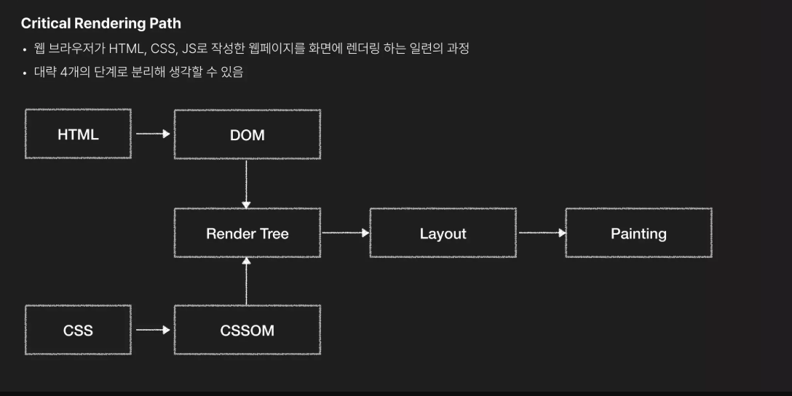
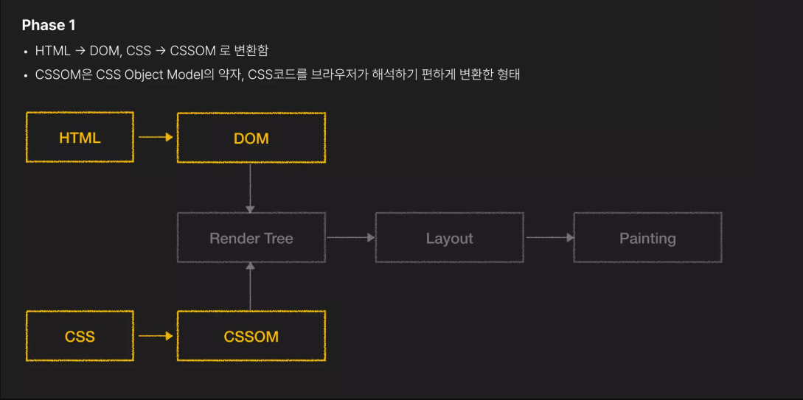
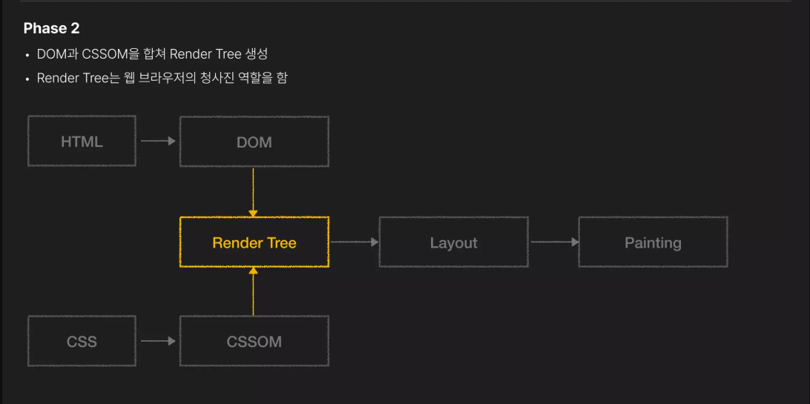
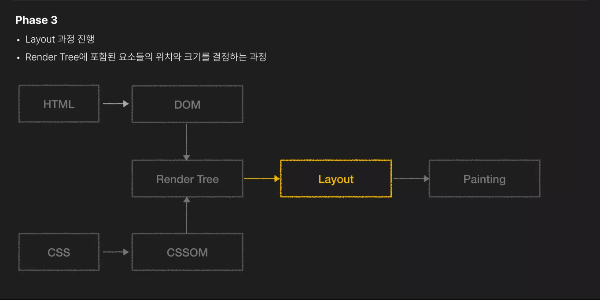
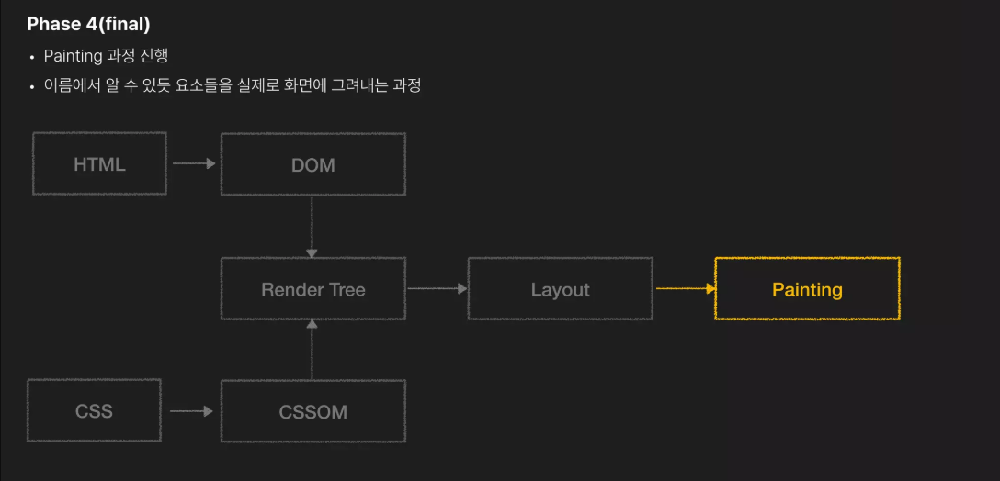
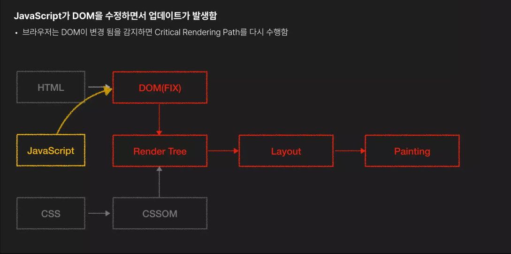
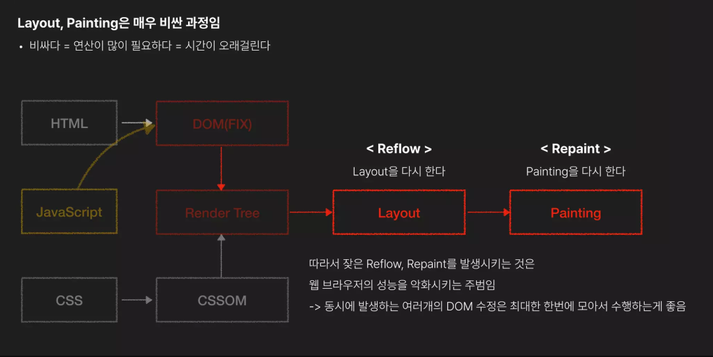
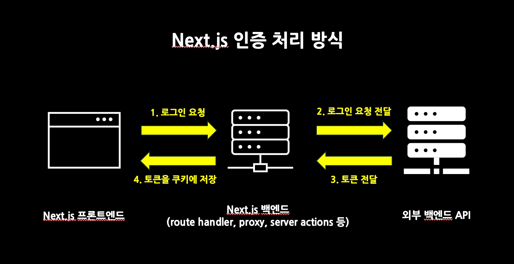
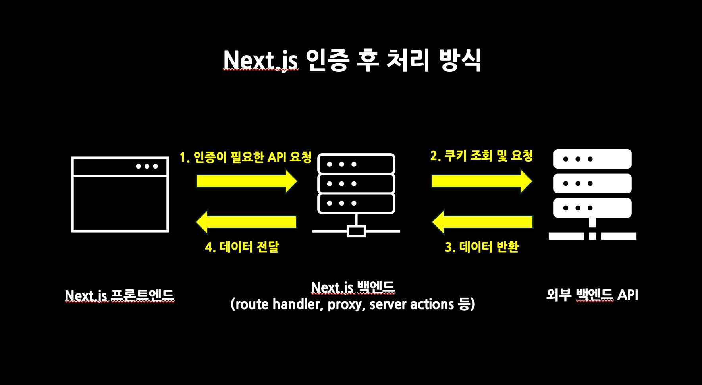

# 2026-02-25 학습 내용 정리

## 목차

1. [GSAP (애니메이션 라이브러리)](#1-gsap-애니메이션-라이브러리)
   - [설치](#설치)
   - [gsap.to](#gsapto)
   - [gsap.from](#gsapfrom)
   - [gsap.fromTo](#gsapfromto)
   - [gsap.timeline](#gsaptimeline)
   - [gsap.registerPlugin](#gsapregisterplugin)
   - [ScrollTrigger / pin](#scrolltrigger--pin)
   - [디버깅 (markers)](#디버깅-markers)
2. [브라우저 렌더링 과정 (Critical Rendering Path)](#2-브라우저-렌더링-과정-critical-rendering-path)
   - [전체 흐름](#전체-흐름)
   - [DOM & CSSOM 생성](#dom--cssom-생성)
   - [Render Tree 생성](#render-tree-생성)
   - [Layout](#layout)
   - [Painting](#painting)
   - [JavaScript에 의한 업데이트](#javascript에-의한-업데이트)
   - [Reflow & Repaint](#reflow--repaint)
3. [requestAnimationFrame](#3-requestanimationframe)
   - [개요](#개요)
   - [기본 사용법](#기본-사용법)
   - [취소 (cancelAnimationFrame)](#취소-cancelanimationframe)
4. [will-change](#4-will-change)
   - [will-change란?](#will-change란)
   - [will-change가 필요한 이유](#will-change가-필요한-이유)
   - [will-change 사용 시 주의점](#will-change-사용-시-주의점)
5. [웹 브라우저 저장소](#5-웹-브라우저-저장소)
   - [웹 스토리지](#웹-스토리지)
   - [쿠키](#쿠키)
   - [쿠키와 웹 스토리지의 주요 차이점](#쿠키와-웹-스토리지의-주요-차이점)
   - [localStorage와 sessionStorage 차이점](#localstorage와-sessionstorage-차이점)
6. [HTTP 프로토콜](#6-http-프로토콜)
   - [HTTP란?](#http란)
   - [무상태성 (Stateless)](#무상태성-stateless)
   - [비연결성 (Connectionless)](#비연결성-connectionless)
7. [쿠키 옵션](#7-쿠키-옵션)
   - [Expires / Max-Age](#expires--max-age)
   - [Domain / Path](#domain--path)
   - [Secure](#secure)
   - [HttpOnly](#httponly)
   - [SameSite](#samesite)
8. [브라우저에서 쿠키 다루기](#8-브라우저에서-쿠키-다루기)
   - [쿠키 추가하기](#쿠키-추가하기)
   - [쿠키 수정하기](#쿠키-수정하기)
   - [특수 문자와 인코딩](#특수-문자와-인코딩)
   - [쿠키 삭제하기](#쿠키-삭제하기)
   - [js-cookie 라이브러리](#js-cookie-라이브러리)
9. [Next.js Server Component에서 쿠키 다루기](#9-nextjs-server-component에서-쿠키-다루기)
   - [Next.js 인증 처리 방식](#nextjs-인증-처리-방식)
   - [Server Component에서 쿠키를 직접 쓸 수 없는 이유](#server-component에서-쿠키를-직접-쓸-수-없는-이유)
   - [Route Handler에서 쿠키 설정하기](#route-handler에서-쿠키-설정하기)
   - [Proxy로 페이지 접근 전 쿠키 확인하기](#proxy로-페이지-접근-전-쿠키-확인하기)

---

## 1. GSAP (애니메이션 라이브러리)

GreenSock Animation Platform. 고성능 웹 애니메이션을 위한 JavaScript 라이브러리.
CSS, SVG, WebGL, React 컴포넌트 등 거의 모든 것을 애니메이션할 수 있음.

### 설치

```bash
npm install gsap
```

```ts
import { gsap } from "gsap";
```

---

### gsap.to

- **현재 상태 → 지정한 상태**로 애니메이션
- 대상 요소를 특정 값으로 이동시킬 때 사용

```js
// x축으로 100px 이동, 1초 동안
gsap.to(".box", { x: 100, duration: 1 });

// ease, opacity 조합
gsap.to(".box", {
  x: 200,
  opacity: 0,
  duration: 0.8,
  ease: "easeOut",
});
```

---

### gsap.from

- **지정한 상태 → 현재 상태**로 애니메이션 (진입 애니메이션에 유용)
- 컴포넌트가 처음 나타날 때 시작 위치를 지정하는 데 자주 사용

```js
// x: 100 위치에서 현재 위치로 이동
gsap.from(".box", { x: 100, duration: 1 });

// 아래에서 위로 페이드인
gsap.from(".title", {
  y: 50,
  opacity: 0,
  duration: 0.6,
  ease: "power2.out",
});
```

---

### gsap.fromTo

- **시작 상태 → 끝 상태** 를 명시적으로 모두 지정
- `from`과 `to` 상태를 둘 다 제어하고 싶을 때 사용

```js
// x: 0에서 x: 100으로 이동
gsap.fromTo(".box", { x: 0 }, { x: 100, duration: 1 });

// opacity 0 → 1, y -50 → 0
gsap.fromTo(
  ".card",
  { opacity: 0, y: -50 },
  { opacity: 1, y: 0, duration: 0.8, ease: "power2.out" },
);
```

> `from`은 현재 CSS 상태를 기준으로 끝 상태가 결정되지만, `fromTo`는 시작/끝을 명시하므로 예측 가능성이 높음

---

### gsap.timeline

- 여러 트윈을 **순차적으로 또는 겹쳐서** 실행하는 컨테이너
- 개별 `delay` 없이 애니메이션 시퀀스를 쉽게 관리할 수 있음
- 전체 타임라인을 하나의 단위로 제어 가능 (pause, reverse, seek 등)

```js
// 기본 사용: 순차 실행
const tl = gsap.timeline();

tl.to(".green", { x: 600, duration: 2 });
tl.to(".purple", { x: 600, duration: 1 });
tl.to(".orange", { x: 600, duration: 1 });
```

```js
// 메서드 체이닝
const tl = gsap.timeline();

tl.to(".box1", { x: 100, duration: 2 })
  .to(".box2", { y: 200, ease: "elastic" })
  .to(".box3", { rotation: 180, duration: 3 });
```

```js
// position 파라미터로 타이밍 제어
const tl = gsap.timeline();

tl.to(".a", { x: 100, duration: 1 })
  .to(".b", { x: 100, duration: 1 }, "-=0.5") // 0.5초 앞당겨 시작 (겹침)
  .to(".c", { x: 100, duration: 1 }, "+=0.2"); // 0.2초 뒤에 시작
```

> `timeline`에도 `.to()`, `.from()`, `.fromTo()` 메서드를 동일하게 사용할 수 있음

---

### gsap.registerPlugin

- GSAP의 플러그인(ScrollTrigger 등)을 사용하기 전에 **반드시 등록**해야 함
- 앱 진입점에서 한 번만 호출하면 됨

```js
import { gsap } from "gsap";
import { ScrollTrigger } from "gsap/ScrollTrigger";

gsap.registerPlugin(ScrollTrigger);
```

```js
// 여러 플러그인 동시 등록
import { ScrollTrigger } from "gsap/ScrollTrigger";
import { ScrollSmoother } from "gsap/ScrollSmoother";

gsap.registerPlugin(ScrollTrigger, ScrollSmoother);
```

> `registerPlugin` 없이 플러그인을 사용하면 트리 쉐이킹으로 번들에서 제거되거나 동작하지 않을 수 있음

---

### ScrollTrigger / pin

- 스크롤 위치에 따라 애니메이션을 제어하는 플러그인
- `scrollTrigger` 옵션을 트윈에 인라인으로 추가하거나, `ScrollTrigger.create()`로 독립 생성 가능
- `pin`: 특정 요소를 스크롤 중에 뷰포트에 고정(sticky)하는 기능

```js
// 인라인 방식: 스크롤에 따라 애니메이션 실행
gsap.to(".box", {
  x: 500,
  scrollTrigger: {
    trigger: ".box", // 기준이 되는 요소
    start: "top center", // trigger 요소의 top이 viewport center에 닿을 때 시작
    end: "bottom center",
    scrub: true, // 스크롤 위치와 애니메이션 연동
  },
});
```

```js
// pin: 요소를 뷰포트에 고정
gsap.to("#sticky-element", {
  scrollTrigger: {
    trigger: "#sticky-element",
    start: "top top",
    end: "+=300", // 300px 스크롤 동안 고정
    pin: true,
    pinSpacing: false, // 핀 공간 자동 추가 비활성화
  },
});
```

```js
// ScrollTrigger.create() 독립 생성
ScrollTrigger.create({
  trigger: ".trigger",
  pin: ".pin", // 고정할 요소 (trigger와 다를 수 있음)
  start: "top center",
  end: "+=500",
});
```

#### ScrollTrigger 주요 속성

| 속성              | 타입                           | 설명                                                                                                |
| ----------------- | ------------------------------ | --------------------------------------------------------------------------------------------------- |
| `trigger`         | `string \| Element`            | 스크롤 기준이 되는 요소 (selector 또는 DOM 요소)                                                    |
| `start`           | `string`                       | 트리거 시작 지점. `"trigger위치 viewport위치"` 형식 (예: `"top center"`)                            |
| `end`             | `string`                       | 트리거 종료 지점. `"bottom top"`, `"+=300"` (px 단위 오프셋) 등                                     |
| `scrub`           | `boolean \| number`            | 스크롤과 애니메이션 연동. `true`: 직결, 숫자: 지연 시간(초) 부여 (예: `scrub: 0.5`)                 |
| `pin`             | `boolean \| string \| Element` | 요소를 뷰포트에 고정. `true`: trigger 요소 고정, selector/요소로 대상 지정 가능                     |
| `pinSpacing`      | `boolean`                      | 고정된 요소의 공간 자동 확보 여부 (기본값: `true`)                                                  |
| `toggleActions`   | `string`                       | 4가지 시점의 동작 설정: `"onEnter onLeave onEnterBack onLeaveBack"` (기본: `"play none none none"`) |
| `markers`         | `boolean \| object`            | 개발용 디버깅 마커 표시                                                                             |
| `pinnedContainer` | `string \| Element`            | 중첩 핀 사용 시 부모 핀 컨테이너 지정                                                               |

#### toggleActions 가능한 값

`"play"`, `"pause"`, `"resume"`, `"reset"`, `"restart"`, `"complete"`, `"reverse"`, `"none"`

```js
// 진입 시 play, 벗어날 때 pause, 다시 진입 시 resume, 다시 벗어날 때 reset
ScrollTrigger.create({
  trigger: "#myElement",
  start: "top center",
  toggleActions: "play pause resume reset",
});
```

#### start / end 형식

```
"trigger위치 scroller위치"
```

- `trigger위치`: `top`, `center`, `bottom` 또는 퍼센트 `"20%"`, 픽셀 `"100px"`
- `scroller위치`: `top`, `center`, `bottom` 또는 퍼센트
- `"+=300"`: 현재 위치에서 300px 이후

```js
start: "top center"; // trigger의 top이 뷰포트 center에 닿을 때
start: "top top"; // trigger의 top이 뷰포트 top에 닿을 때
end: "bottom top"; // trigger의 bottom이 뷰포트 top에 닿을 때
end: "+=500"; // 시작 지점에서 500px 스크롤 후
```

---

### 디버깅 (markers)

- `markers: true`로 설정하면 스크롤 트리거의 **시작/끝 지점을 화면에 시각적으로 표시**
- 개발 중 트리거 위치를 직관적으로 확인할 수 있음
- **배포 전에 반드시 제거**해야 함

```js
gsap.to("#element", {
  opacity: 0.5,
  scrollTrigger: {
    trigger: "#element",
    start: "top center",
    end: "bottom center",
    markers: true, // 기본 마커 표시
  },
});
```

```js
// 마커 커스텀 옵션
gsap.to("#element", {
  x: 200,
  scrollTrigger: {
    trigger: "#element",
    start: "top center",
    end: "bottom top",
    markers: {
      startColor: "rgba(0,255,0,1)", // 시작 마커 색상
      endColor: "rgba(255,0,0,1)", // 끝 마커 색상
      fontSize: "12px",
      indent: 10, // 마커 들여쓰기
    },
  },
});
```

> 마커를 활성화하면 페이지에 `scroller-start`, `scroller-end`, `start`, `end` 레이블이 표시되어 트리거 시점을 정확히 파악할 수 있음

---

## 2. 브라우저 렌더링 과정 (Critical Rendering Path)

웹 브라우저가 HTML, CSS, JS로 작성한 웹페이지를 화면에 렌더링하는 일련의 과정.
대략 4개의 단계로 분리해 생각할 수 있음.

### 전체 흐름



```
HTML → DOM  ↘
              Render Tree → Layout → Painting
CSS → CSSOM ↗
```

---

### DOM & CSSOM 생성



- **HTML → DOM**: 브라우저가 HTML을 파싱해 DOM(Document Object Model) 트리로 변환
- **CSS → CSSOM**: CSS를 파싱해 CSSOM(CSS Object Model) 트리로 변환
  - CSSOM은 CSS Object Model의 약자로, CSS 코드를 브라우저가 해석하기 편하게 변환한 형태

---

### Render Tree 생성



- DOM과 CSSOM을 합쳐 **Render Tree** 생성
- Render Tree는 웹 브라우저의 **청사진** 역할을 함
- 실제로 화면에 표시될 요소만 포함됨 (`display: none` 요소는 제외)

---

### Layout



- Render Tree에 포함된 **요소들의 위치와 크기를 결정**하는 과정
- 뷰포트 크기를 기준으로 각 요소의 정확한 좌표와 치수를 계산함
- **Reflow**라고도 부름

---

### Painting



- 이름에서 알 수 있듯 **요소들을 실제로 화면에 그려내는** 과정
- Layout에서 계산된 위치/크기를 바탕으로 픽셀을 화면에 채움
- **Repaint**라고도 부름

---

### JavaScript에 의한 업데이트



- JavaScript가 DOM을 수정하면 업데이트가 발생함
- 브라우저는 DOM이 변경됨을 감지하면 **Critical Rendering Path를 다시 수행**함
  - DOM 수정 → Render Tree 재생성 → Layout → Painting 순으로 재실행

---

### Reflow & Repaint



- **Layout(Reflow)** 과 **Painting(Repaint)** 은 매우 비싼 과정
  - 비싸다 = 연산이 많이 필요하다 = 시간이 오래 걸린다
- JavaScript가 DOM을 수정할 때마다 Reflow → Repaint가 발생
- 잦은 Reflow, Repaint는 **웹 브라우저 성능을 악화시키는 주범**

> 동시에 발생하는 여러 개의 DOM 수정은 **최대한 한번에 모아서 수행**하는 게 좋음

---

## 3. requestAnimationFrame

### 개요

- 브라우저에게 **다음 repaint 직전에 특정 함수를 실행**해달라고 요청하는 Web API
- 브라우저의 화면 갱신 주기(60fps = 약 16.6ms마다)에 맞춰 콜백을 호출함
  (모니터 주사율 혹은 브라우저가 하드웨어 성능 및 설정에 따라 달라질 수 있음)
- `setInterval`이나 `setTimeout`과 달리 **브라우저 렌더링 타이밍에 정확히 동기화**되므로, 애니메이션이 부드럽고 성능이 좋음
- 탭이 비활성화되면 자동으로 호출을 멈춰 **불필요한 연산을 방지**함

```
setInterval / setTimeout  →  타이밍 보장 X, 렌더링과 비동기
requestAnimationFrame     →  다음 프레임 직전 호출, 렌더링과 동기화
```

---

### 기본 사용법

- **한 번만 실행**되므로, 반복하려면 콜백 내부에서 재귀 호출해야 함 (애니메이션 루프)

```js
function animate() {
  // 애니메이션 로직 작성

  // 다음 프레임 요청
  requestAnimationFrame(animate);
}

// 애니메이션 시작
requestAnimationFrame(animate);
```

> `elapsed / duration`으로 진행률(0~1)을 계산하면 프레임 속도와 무관하게 **시간 기반 애니메이션**을 구현할 수 있음

---

### 취소 (cancelAnimationFrame)

- `requestAnimationFrame`은 **ID**를 반환하며, 이를 `cancelAnimationFrame`에 전달하면 예약된 콜백을 취소할 수 있음

```js
const animationId = requestAnimationFrame(animate);

// 애니메이션 중지
cancelAnimationFrame(animationId);
```

> React에서는 `useEffect` 클린업 함수에서 `cancelAnimationFrame`을 호출해 메모리 누수를 방지해야 함

```js
useEffect(() => {
  let rafId;

  function animate(timestamp) {
    // ...
    rafId = requestAnimationFrame(animate);
  }

  rafId = requestAnimationFrame(animate);

  return () => cancelAnimationFrame(rafId); // 언마운트 시 취소
}, []);
```

---

## 4. will-change

### will-change란?

브라우저에게 **"이 요소는 곧 변경될 것"** 이라고 미리 알려주는 CSS 속성.
브라우저는 이 힌트를 바탕으로 해당 요소를 **별도의 레이어(Compositing Layer)로 분리**해 GPU가 처리하도록 준비함.

```css
.box {
  will-change: transform;
}

/* 여러 속성 지정 */
.box {
  will-change: transform, opacity;
}
```

---

### will-change가 필요한 이유

브라우저의 렌더링 파이프라인에서 **Layout과 Paint는 CPU가 처리하는 비싼 작업**임.
`will-change`로 요소를 별도 레이어로 분리해두면, 해당 요소의 변화가 생길 때 **Layout/Paint를 다시 하지 않고 Composite(레이어 합성)만으로 화면을 업데이트**할 수 있음.

```
will-change 없음: JS → Layout → Paint → Composite  (매번 전체 파이프라인 실행)
will-change 있음: JS →                  Composite  (레이어 합성만으로 처리, GPU 활용)
```

`transform`과 `opacity`는 Composite 단계에서만 처리되므로, 이 두 속성을 애니메이션할 때 `will-change`의 효과가 가장 큼.

---

### will-change 사용 시 주의점

- **남용 금지** — 모든 요소에 적용하면 오히려 메모리 낭비로 성능이 저하됨. 실제로 애니메이션이 발생하는 요소에만 사용해야 함
- **애니메이션 직전에 적용, 직후에 제거** — JavaScript로 동적으로 추가/제거하는 것이 이상적

```js
element.addEventListener("mouseenter", () => {
  element.style.willChange = "transform";
});

element.addEventListener("animationend", () => {
  element.style.willChange = "auto"; // 애니메이션 끝나면 제거
});
```

- **`transform`, `opacity` 이외의 속성**은 Composite만으로 처리되지 않아 효과가 제한적임
- `will-change: scroll-position` 처럼 스크롤 최적화에도 사용할 수 있지만, 마찬가지로 필요한 경우에만 적용

> `will-change`는 공식 문서에서 최후의 최적화 수단이라고 한다. 먼저 `transform`/`opacity` 기반 애니메이션으로 설계하고, 실제로 성능 문제가 확인된 경우에만 사용할 것 (성능 예측하고 사용 x)

---

## 5. 웹 브라우저 저장소

### 웹 스토리지

브라우저에 키-값 쌍을 저장하는 Web API. **localStorage**와 **sessionStorage** 두 가지가 있음.

#### 로컬 스토리지 (localStorage)

- 브라우저를 닫아도 데이터가 **영구적으로 유지**됨
- 같은 출처(origin)의 모든 탭/창에서 공유됨
- 용량: 약 5MB

```js
// 저장
localStorage.setItem("name", "홍길동");

// 읽기
localStorage.getItem("name"); // "홍길동"

// 삭제
localStorage.removeItem("name");

// 전체 삭제
localStorage.clear();
```

#### 세션 스토리지 (sessionStorage)

- **탭(브라우저 세션)이 닫히면 데이터가 삭제**됨
- 같은 출처라도 탭마다 독립적으로 존재 (공유 X)
- 용량: 약 5MB

```js
// 저장
sessionStorage.setItem("token", "abc123");

// 읽기
sessionStorage.getItem("token"); // "abc123"

// 삭제
sessionStorage.removeItem("token");

// 전체 삭제
sessionStorage.clear();
```

> 웹 스토리지는 **문자열만 저장** 가능. 객체를 저장할 때는 `JSON.stringify`, 읽을 때는 `JSON.parse` 사용

```js
// 객체 저장
localStorage.setItem("user", JSON.stringify({ name: "홍길동", age: 30 }));

// 객체 읽기
const user = JSON.parse(localStorage.getItem("user"));
```

---

### 쿠키

- 브라우저와 서버 간에 주고받는 작은 데이터 조각
- **서버가 `Set-Cookie` 헤더로 설정**하거나, JavaScript로 직접 설정할 수 있음
- HTTP 요청 시 자동으로 서버에 함께 전송됨
- 용량: 약 4KB (웹 스토리지보다 훨씬 작음)
- `expires` 또는 `max-age`로 만료 시간 설정 가능

```js
// 쿠키 설정
document.cookie = "name=홍길동; max-age=3600; path=/";

// 쿠키 읽기 (전체 문자열로 반환됨)
document.cookie; // "name=홍길동; theme=dark"
```

---

### 쿠키와 웹 스토리지의 주요 차이점

| 항목      | 쿠키                              | 웹 스토리지                                          |
| --------- | --------------------------------- | ---------------------------------------------------- |
| 용량      | 약 4KB                            | 약 5MB                                               |
| 서버 전송 | HTTP 요청 시 **자동 전송**        | 전송 안 됨 (클라이언트 전용)                         |
| 만료 설정 | `expires` / `max-age`로 설정 가능 | localStorage: 영구 / sessionStorage: 탭 종료 시 삭제 |
| 접근      | 서버 & 클라이언트                 | 클라이언트만                                         |
| 주요 용도 | 인증 토큰, 세션 관리              | UI 상태, 사용자 설정 등 클라이언트 데이터            |

---

### localStorage와 sessionStorage 차이점

| 항목        | localStorage                                 | sessionStorage                         |
| ----------- | -------------------------------------------- | -------------------------------------- |
| 데이터 유지 | 영구 (직접 삭제 전까지)                      | 탭/창 종료 시 삭제                     |
| 탭 간 공유  | 같은 origin이면 **공유**                     | 탭마다 **독립적** (공유 안 됨)         |
| 주요 용도   | 다크모드 설정, 언어 설정 등 장기 보존 데이터 | 폼 임시 저장, 페이지 이동 간 상태 유지 |

---

## 6. HTTP 프로토콜

### HTTP란?

**HyperText Transfer Protocol**. 클라이언트(브라우저)와 서버 간에 데이터를 주고받기 위한 통신 규약.
웹에서 HTML, 이미지, JSON 등 모든 데이터는 HTTP 메시지를 통해 전송됨.

```
클라이언트          서버
   │                 │
   │──── 요청 ─────▶│  (Request)
   │                 │
   │◀─── 응답 ──────│  (Response)
   │                 │
```

- **요청(Request)**: 클라이언트가 서버에 데이터를 요청 (URL, 메서드, 헤더, 바디 포함)
- **응답(Response)**: 서버가 클라이언트에 결과를 반환 (상태 코드, 헤더, 바디 포함)

---

### 무상태성 (Stateless)

- HTTP는 **각 요청이 독립적**이며, 서버는 이전 요청의 상태를 기억하지 않음
- 요청 A와 요청 B 사이에 아무런 연관이 없음 → 서버 입장에서 매 요청이 처음 보는 클라이언트

```
요청 1: "안녕하세요"  → 서버 응답
요청 2: "아까 말했던 거 기억해?"  → 서버: "모름" ← 이전 상태 없음
```

> 이 때문에 로그인 상태 유지에는 **쿠키, 세션, 토큰** 등 별도 수단이 필요함

---

### 비연결성 (Connectionless)

- HTTP는 요청-응답이 끝나면 **연결을 즉시 끊음**
- 서버가 수많은 클라이언트를 동시에 처리해야 하므로, 연결을 유지하지 않아 **서버 자원을 효율적으로 사용**할 수 있음

```
클라이언트          서버
   │                 │
   │──── 요청 ─────▶│
   │◀─── 응답 ──────│
   │   연결 종료     │  ← 응답 후 즉시 끊음
```

> 단, 매번 연결을 새로 맺는 오버헤드가 있어 **HTTP/1.1부터 Keep-Alive**, **HTTP/2부터 멀티플렉싱**으로 성능을 개선함

---

## 7. 쿠키 옵션

쿠키를 설정할 때 `name=value` 외에 다양한 옵션을 세미콜론으로 구분해 붙일 수 있음.
서버는 `Set-Cookie` 응답 헤더로, 클라이언트는 `document.cookie`로 설정함.

```
Set-Cookie: name=value; Expires=날짜; Path=/; Secure; HttpOnly; SameSite=Lax
```

---

### Expires / Max-Age

쿠키의 **유효기간(수명)** 을 설정하는 옵션. 둘 중 하나만 사용하면 됨.

| 옵션      | 설명                                                    |
| --------- | ------------------------------------------------------- |
| `Expires` | 쿠키가 만료될 **날짜/시각**을 UTC 형식으로 지정         |
| `Max-Age` | 쿠키가 만료될 때까지의 **초(seconds) 단위 시간**을 지정 |

- 둘 다 설정하지 않으면 **세션 쿠키**: 브라우저를 닫으면 삭제됨
- 둘 다 설정하면 `Max-Age`가 우선순위를 가짐

```js
// Expires: 특정 날짜까지 유지
document.cookie = "name=홍길동; Expires=Fri, 01 Jan 2027 00:00:00 GMT";

// Max-Age: 3600초(1시간) 후 만료
document.cookie = "name=홍길동; Max-Age=3600";

// Max-Age=0 또는 음수 → 즉시 삭제
document.cookie = "name=홍길동; Max-Age=0";
```

---

### Domain / Path

쿠키가 전송되거나 접근 가능한 **유효 범위**를 제한하는 옵션.

#### Domain

- 쿠키를 전송할 **도메인 범위**를 지정
- 설정하지 않으면 쿠키를 설정한 도메인에서만 전송됨 (서브도메인 제외)
- 명시적으로 설정하면 해당 도메인과 **모든 서브도메인**에서 전송됨

```
# example.com에서만 전송 (서브도메인 제외)
Set-Cookie: name=value

# example.com + sub.example.com 모두 전송
Set-Cookie: name=value; Domain=example.com
```

#### Path

- 쿠키를 전송할 **URL 경로 범위**를 지정
- 해당 경로와 그 하위 경로의 요청에만 쿠키가 전송됨
- 기본값: `/` (전체 경로)

```
# /admin 및 /admin/* 경로의 요청에만 전송
Set-Cookie: name=value; Path=/admin

# 모든 경로에 전송 (기본값)
Set-Cookie: name=value; Path=/
```

---

### Secure

- `Secure` 속성이 설정된 쿠키는 **HTTPS 연결에서만 서버로 전송**됨
- HTTP(비암호화) 연결에서는 전송되지 않으므로, 민감한 쿠키를 평문으로 노출하는 것을 방지함
- `localhost`는 예외적으로 HTTP에서도 Secure 쿠키를 허용함

```
Set-Cookie: token=abc123; Secure
```

```js
document.cookie = "token=abc123; Secure";
```

> 인증 토큰 등 민감한 정보를 담은 쿠키에는 반드시 `Secure`를 설정해야 함

---

### HttpOnly

- `HttpOnly` 속성이 설정된 쿠키는 **JavaScript(`document.cookie`)로 접근할 수 없음**
- 서버에서만 설정 가능 (`Set-Cookie` 헤더)
- XSS(크로스 사이트 스크립팅) 공격으로 JavaScript를 통해 쿠키를 탈취하는 것을 방지

```
Set-Cookie: session=xyz; HttpOnly
```

```js
// HttpOnly 쿠키는 JS에서 읽을 수 없음
document.cookie; // session 쿠키가 보이지 않음
```

> `Secure`와 함께 사용하면 **HTTPS + JS 접근 차단**이 동시에 적용되어 보안이 강화됨

---

### SameSite

- **cross-site 요청**(다른 도메인에서 발생한 요청)에서 쿠키를 전송할지 여부를 결정
- CSRF(크로스 사이트 요청 위조) 공격을 방어하는 데 사용됨

#### SameSite 설정 3가지

| 값       | 설명                                                                                 |
| -------- | ------------------------------------------------------------------------------------ |
| `Strict` | **같은 사이트에서 발생한 요청에만** 쿠키 전송. cross-site 요청에는 절대 전송 안 됨   |
| `Lax`    | 기본값. **같은 사이트 요청 + 일부 cross-site 요청**(GET + 최상위 탐색)에는 쿠키 전송 |
| `None`   | **모든 cross-site 요청에 쿠키 전송**. 반드시 `Secure`와 함께 사용해야 함             |

```
# Strict: 같은 사이트에서만 전송
Set-Cookie: session=abc; SameSite=Strict

# Lax: 기본값, 안전한 cross-site 요청도 허용
Set-Cookie: session=abc; SameSite=Lax

# None: 모든 cross-site 허용 (Secure 필수)
Set-Cookie: session=abc; SameSite=None; Secure
```

#### Lax의 "일부 cross-site 요청"이란?

`Lax`는 다음 조건을 **모두** 만족하는 경우에만 cross-site 요청에 쿠키를 전송함:

1. **GET 요청** (POST, PUT 등 상태 변경 메서드는 제외)
2. **최상위 탐색**(Top-level navigation): 브라우저 주소창 URL이 변경되는 요청 (링크 클릭, 리다이렉트 등)

> ``, `<iframe>`, `fetch`, `XMLHttpRequest` 등으로 발생하는 cross-site 요청은 `Lax`에서도 쿠키가 전송되지 않음

---

## 8. 브라우저에서 쿠키 다루기

브라우저에서 JavaScript로 쿠키를 읽고 쓸 때는 `document.cookie`를 사용함.
`document.cookie`는 일반 문자열처럼 보이지만, **값을 대입할 때마다 해당 쿠키 하나만 추가/수정**되는 특수한 프로퍼티임.

---

### 쿠키 추가하기

`document.cookie`에 `"key=value"` 형식으로 할당하면 쿠키가 추가됨.
옵션은 세미콜론으로 이어 붙임.

```js
// 기본 추가
document.cookie = "username=홍길동";

// 옵션과 함께 추가
document.cookie = "username=홍길동; Max-Age=3600; path=/";
```

```js
// 현재 저장된 모든 쿠키 확인 (key=value; key2=value2 형식의 문자열)
console.log(document.cookie);
```

> `document.cookie`에 새 값을 할당해도 기존 쿠키는 삭제되지 않음. 같은 이름의 쿠키가 없으면 추가, 있으면 수정됨

---

### 쿠키 수정하기

같은 `name`, `domain`, `path`를 가진 쿠키에 새 값을 할당하면 덮어씌워짐.

```js
// username 쿠키 추가
document.cookie = "username=홍길동; path=/";

// 같은 name + path로 다시 할당 → 값이 수정됨
document.cookie = "username=김철수; path=/";

console.log(document.cookie); // "username=김철수"
```

> `path`가 다르면 별개의 쿠키로 취급되므로 수정이 아닌 새 쿠키가 추가됨

---

### 특수 문자와 인코딩

쿠키 값에는 공백, 한글, `=`, `;` 등 **특수 문자를 그대로 사용할 수 없음**.
`encodeURIComponent`로 인코딩하고, 읽을 때 `decodeURIComponent`로 복원해야 함.

#### encodeURIComponent — 저장 시 인코딩

```js
const value = "안녕하세요 홍길동";

// 인코딩 후 저장
document.cookie = `greeting=${encodeURIComponent(value)}; path=/`;

// 저장된 값: greeting=%EC%95%88%EB%85%95%ED%95%98%EC%84%B8%EC%9A%94%20%ED%99%8D%EA%B8%B8%EB%8F%99
```

#### decodeURIComponent — 읽을 때 복원

`document.cookie`는 `"key=value; key2=value2"` 형태의 단일 문자열을 반환하므로,
파싱 후 `decodeURIComponent`로 값을 복원해야 함.

```js
// 쿠키 문자열을 파싱해 특정 키의 값을 가져오는 헬퍼 함수
function getCookie(name) {
  const cookies = document.cookie.split("; ");
  for (const cookie of cookies) {
    const [key, value] = cookie.split("=");
    if (key === name) return decodeURIComponent(value);
  }
  return null;
}

getCookie("greeting"); // "안녕하세요 홍길동"
```

> `encodeURIComponent` / `decodeURIComponent`를 일관되게 쌍으로 사용해야 인코딩 오류를 방지할 수 있음

---

### 쿠키 삭제하기

쿠키를 직접 삭제하는 API는 없음. **`Max-Age=0`(또는 음수)** 또는 **과거 날짜의 `Expires`** 를 설정해 즉시 만료시키는 방식을 사용함.

삭제할 때는 **추가할 때와 동일한 `name`, `path`, `domain`** 을 지정해야 함.

```js
// Max-Age=0으로 즉시 만료 (가장 간단한 방법)
document.cookie = "username=; Max-Age=0; path=/";

// 과거 날짜의 Expires로 만료
document.cookie = "username=; Expires=Thu, 01 Jan 1970 00:00:00 GMT; path=/";
```

> `path`를 다르게 지정하면 해당 쿠키를 찾지 못해 삭제가 되지 않으므로 주의

---

### js-cookie 라이브러리

`document.cookie`의 문자열 파싱, 인코딩/디코딩, 옵션 처리를 직접 구현하는 번거로움을 해결해주는 라이브러리.

#### 설치

```bash
npm install js-cookie
```

```js
import Cookies from "js-cookie";
```

#### 쿠키 추가 / 수정

```js
// 기본 추가 (세션 쿠키)
Cookies.set("username", "홍길동");

// 옵션과 함께 추가
Cookies.set("username", "홍길동", { expires: 7, path: "/" });
// expires: 숫자(일) 또는 Date 객체
```

#### 쿠키 읽기

```js
Cookies.get("username"); // "홍길동"

// 모든 쿠키를 객체로 반환
Cookies.get(); // { username: "홍길동", theme: "dark" }
```

#### 쿠키 삭제

```js
Cookies.remove("username");

// path를 지정한 경우 삭제 시 동일하게 지정해야 함
Cookies.remove("username", { path: "/" });
```

#### js-cookie vs document.cookie 비교

| 항목      | `document.cookie`                  | `js-cookie`                        |
| --------- | ---------------------------------- | ---------------------------------- |
| 값 인코딩 | 수동으로 `encodeURIComponent` 처리 | 자동 처리                          |
| 쿠키 읽기 | 전체 문자열 파싱 필요              | `Cookies.get("key")`으로 바로 접근 |
| 쿠키 삭제 | `Max-Age=0` 수동 설정              | `Cookies.remove("key")`            |
| 옵션 설정 | 문자열로 직접 이어붙임             | 객체로 전달                        |
| 직관성    | 낮음 (문자열 기반)                 | 높음 (메서드 기반)                 |

---

## 9. Next.js Server Component에서 쿠키 다루기

### Next.js 인증 처리 방식

Next.js에서 인증(로그인)은 **프론트엔드 → Next.js 백엔드 → 외부 백엔드 API** 의 흐름으로 처리됨.
쿠키는 보안을 위해 클라이언트가 아닌 **Next.js 백엔드(Route Handler, Server Action 등)에서 설정**하는 것이 일반적임.

#### 인증(로그인) 흐름



1. **로그인 요청**: 프론트엔드가 Next.js 백엔드로 로그인 요청을 보냄
2. **로그인 요청 전달**: Next.js 백엔드가 외부 백엔드 API로 요청을 전달
3. **토큰 전달**: 외부 백엔드 API가 인증 토큰을 Next.js 백엔드로 반환
4. **토큰을 쿠키에 저장**: Next.js 백엔드가 응답 헤더의 `Set-Cookie`로 토큰을 쿠키에 저장

#### 인증 후 API 요청 흐름



1. **인증이 필요한 API 요청**: 프론트엔드가 Next.js 백엔드로 요청을 보냄 (쿠키 자동 포함)
2. **쿠키 조회 및 요청**: Next.js 백엔드가 쿠키에서 토큰을 꺼내 외부 백엔드 API에 인증 헤더와 함께 요청
3. **데이터 반환**: 외부 백엔드 API가 데이터를 Next.js 백엔드로 반환
4. **데이터 전달**: Next.js 백엔드가 프론트엔드로 데이터를 전달

> 외부 백엔드 API의 토큰을 브라우저에 직접 노출하지 않고, Next.js 백엔드가 **중간 프록시** 역할을 함으로써 보안을 강화

---

### Server Component에서 쿠키를 직접 쓸 수 없는 이유

Next.js의 **Server Component는 서버에서 렌더링**되므로 브라우저 환경의 `document.cookie`에 접근할 수 없음.
또한 Server Component는 **읽기 전용** 으로 동작하기 때문에 렌더링 중 응답 헤더(`Set-Cookie`)를 수정하는 것도 불가능함.

```
document.cookie      → 브라우저 전용, Server Component에서 사용 불가
js-cookie            → 브라우저 전용, Server Component에서 사용 불가
응답 헤더 Set-Cookie  → Server Component 렌더링 도중 설정 불가
```

쿠키를 **쓰는(set/delete)** 작업은 반드시 **Route Handler** 에서 수행해야 함.
쿠키를 **읽는(get)** 작업은 Server Component에서도 `next/headers`의 `cookies()`로 가능함.

---

### Route Handler에서 쿠키 설정하기

로그인 처리처럼 **응답 시 쿠키를 설정**해야 하는 경우 Route Handler를 사용함.

```ts
// app/api/login/route.ts
import { cookies } from "next/headers";
import { NextResponse } from "next/server";

export async function POST(request: Request) {
  const { email, password } = await request.json();

  // 외부 백엔드 API에 로그인 요청
  const res = await fetch("https://api.example.com/login", {
    method: "POST",
    body: JSON.stringify({ email, password }),
    headers: { "Content-Type": "application/json" },
  });
  const { token } = await res.json();

  // Next.js 백엔드에서 쿠키에 토큰 저장
  const cookieStore = await cookies();
  cookieStore.set("token", token, {
    httpOnly: true,
    secure: true,
    maxAge: 60 * 60 * 24 * 7,
    path: "/",
    sameSite: "lax",
  });

  return NextResponse.json({ success: true });
}
```

```ts
// app/api/logout/route.ts
import { cookies } from "next/headers";
import { NextResponse } from "next/server";

export async function POST() {
  const cookieStore = await cookies();
  cookieStore.delete("token");

  return NextResponse.json({ success: true });
}
```

---

### Proxy로 페이지 접근 전 쿠키 확인하기

**Proxy**는 요청이 페이지나 API에 도달하기 **전에** 실행되는 Next.js의 서버 레이어 (구 Middleware).
쿠키에 토큰이 없는 비로그인 사용자가 인증이 필요한 페이지에 접근하려 할 때 **미리 차단하고 리다이렉트**하는 데 사용함.

- `src/proxy.ts` 파일을 생성하면 자동으로 적용됨
- `config.matcher`로 Proxy를 실행할 경로를 지정할 수 있음
- 함수 이름은 `proxy` 또는 `default export`로 작성

```ts
// src/proxy.ts
import { cookies } from "next/headers";
import { NextResponse } from "next/server";
import type { NextRequest } from "next/server";

export async function proxy(request: NextRequest) {
  const cookieStore = await cookies();
  const token = cookieStore.get("token")?.value;

  if (!token) {
    console.log("페이지 렌더링 전 여기서 먼저 처리해버림");
    return NextResponse.redirect(new URL("/login", request.url));
  }

  return NextResponse.next();
}

export const config = {
  matcher: ["/mypage"],
};
```

- `cookies()`로 쿠키 스토어를 가져온 뒤 `get("token")`으로 토큰 존재 여부를 확인
- 토큰이 없으면 페이지 렌더링 없이 즉시 `/login`으로 리다이렉트
- 토큰이 있으면 `NextResponse.next()`로 요청을 그대로 통과시킴
- `matcher`에 `/mypage`를 지정했으므로 해당 경로 요청에만 Proxy가 실행됨

#### matcher 패턴 예시

| 패턴                                        | 설명                                                  |
| ------------------------------------------- | ----------------------------------------------------- |
| `"/mypage"`                                 | `/mypage` 경로에만 적용                               |
| `"/dashboard/:path*"`                       | `/dashboard` 및 모든 하위 경로에 적용                 |
| `["/mypage", "/dashboard/:path*"]`          | 여러 경로에 동시 적용                                 |
| `"/((?!api\|_next/static\|_next/image).*)"` | API, 정적 파일, 이미지 최적화 경로를 제외한 모든 경로 |

> `matcher` 값은 빌드 타임에 정적 분석되므로 변수나 동적 값을 사용할 수 없음

#### 쿠키 사용 가능 위치 정리

| 위치             |              쿠키 읽기              | 쿠키 쓰기/삭제 |
| ---------------- | :---------------------------------: | :------------: |
| Server Component |                 ✅                  |       ❌       |
| Route Handler    |                 ✅                  |       ✅       |
| Proxy            |          ✅ (`cookies()`)           |       ❌       |
| Client Component | ✅ (`document.cookie`, `js-cookie`) |       ✅       |
