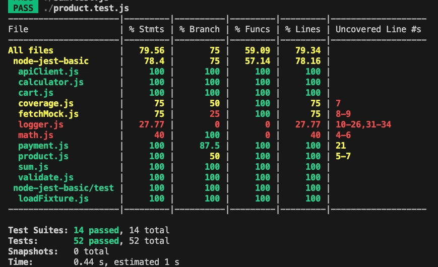
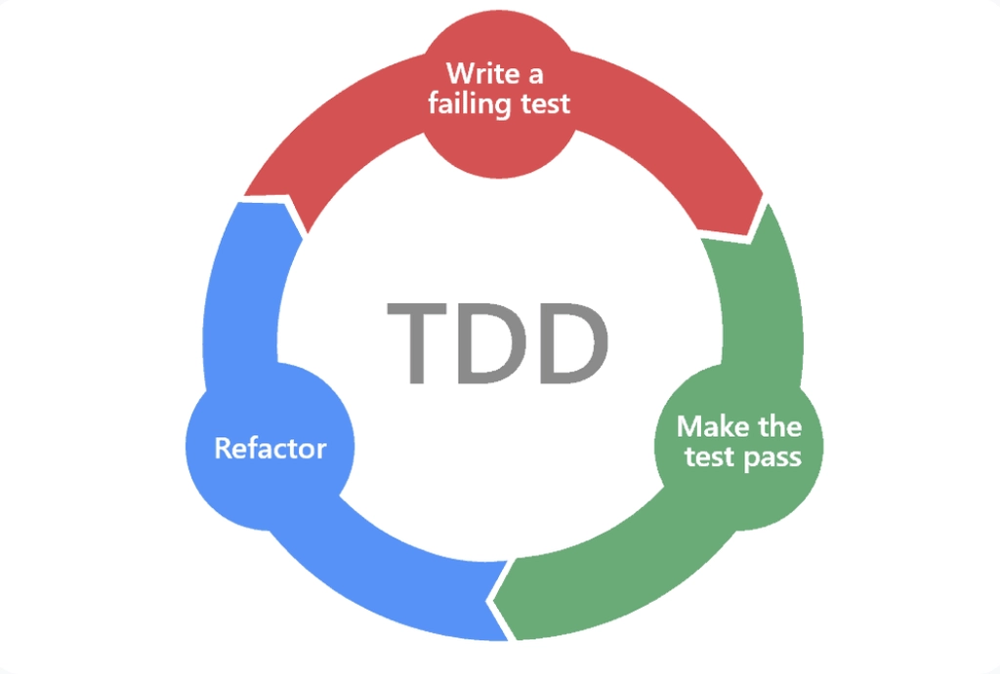

# 2026-03-04 학습 내용 정리 (Jest)

## 목차

1. [테스트 커버리지](#1-테스트-커버리지)
   - [테스트 커버리지란?](#테스트-커버리지란)
   - [테스트 커버리지 확인하기](#테스트-커버리지-확인하기)
   - [테스트 커버리지 유형](#테스트-커버리지-유형)
   - [커버리지 설정](#커버리지-설정)
2. [TDD](#2-tdd)
   - [TDD란?](#tdd란)
   - [TDD 사이클](#tdd-사이클)
   - [TDD의 장단점](#tdd의-장단점)

---

## 1. 테스트 커버리지

### 테스트 커버리지란?

테스트 커버리지(Test Coverage)는 **테스트가 소스 코드를 얼마나 실행했는지**를 나타내는 지표다.
커버리지가 높을수록 더 많은 코드 경로가 테스트로 검증되었음을 의미한다.

```
전체 코드 중 테스트가 실행한 코드의 비율 = 테스트 커버리지
```

커버리지를 측정하면:

- 테스트가 누락된 코드 영역을 파악할 수 있다
- 코드 변경 시 회귀(regression) 위험을 낮출 수 있다
- 테스트 품질을 객관적인 수치로 확인할 수 있다

> 커버리지 100%가 버그가 없다는 것을 보장하지는 않는다. 잘못된 로직도 커버리지를 채울 수 있으므로, 수치보다 **테스트의 의미**가 더 중요하다.

---

### 테스트 커버리지 확인하기

`--coverage` 플래그를 붙여 Jest를 실행하면 커버리지 리포트를 생성한다.

```bash
# package.json 스크립트로 실행
npm run test:coverage
```

실행 후 터미널에 다음과 같은 표 형태의 리포트가 출력된다.



| 열 이름     | 의미                             |
| ----------- | -------------------------------- |
| `File`      | 파일 이름                        |
| `% Stmts`   | 구문(Statement) 커버리지         |
| `% Branch`  | 분기(Branch) 커버리지            |
| `% Funcs`   | 함수(Function) 커버리지          |
| `% Lines`   | 라인(Line) 커버리지              |
| `Uncovered` | 테스트가 실행하지 않은 라인 번호 |

`Uncovered` 열의 라인 번호를 보면 어느 코드가 테스트되지 않았는지 바로 확인할 수 있다.

리포트는 `coverage/` 폴더에도 저장된다. `coverage/lcov-report/index.html`을 브라우저로 열면 파일별로 어떤 라인이 실행됐는지 색상으로 시각화된 상세 리포트를 볼 수 있다.

---

### 테스트 커버리지 유형

Jest는 네 가지 커버리지 유형을 측정한다.

#### 구문 커버리지 (Statements Coverage)

**실행된 구문(statement)의 비율**이다.

```js
function getDiscount(price, isMember) {
  let discount = 0; // 구문 1
  if (isMember) {
    discount = price * 0.1; // 구문 2 ← isMember가 false면 실행되지 않음
  }
  return price - discount; // 구문 3
}
```

위 코드를 `isMember = false`로만 테스트하면 구문 2가 실행되지 않아 구문 커버리지는 2/3 = **67%** 가 된다.

---

#### 분기 커버리지 (Branch Coverage)

**`if`, `switch`, 삼항 연산자 등 분기의 모든 경우(true/false)를 실행한 비율**이다.
구문 커버리지보다 더 엄격한 기준이다.

```js
function getLabel(score) {
  if (score >= 90) {
    return "A"; // 분기 1: true
  } else {
    return "B"; // 분기 2: false
  }
}
```

`score = 95`로만 테스트하면 `else` 분기가 실행되지 않아 분기 커버리지는 **50%** 가 된다.
분기 커버리지 100%를 달성하려면 `true`와 `false` 두 경우 모두 테스트해야 한다.

---

#### 함수 커버리지 (Function Coverage)

**정의된 함수 중 한 번 이상 호출된 함수의 비율**이다.

```js
function add(a, b) {
  return a + b;
} // 테스트에서 호출됨
function subtract(a, b) {
  return a - b;
} // 테스트에서 호출되지 않음
```

테스트에서 `add`만 호출했다면 함수 커버리지는 1/2 = **50%** 가 된다.

---

#### 라인 커버리지 (Line Coverage)

**실행된 코드 라인의 비율**이다.
구문 커버리지와 유사하지만, 한 라인에 여러 구문이 있어도 라인 단위로 계산하는 점이 다르다.

```js
// 한 줄에 여러 구문 — 라인 커버리지는 1개, 구문 커버리지는 3개로 집계
const x = 1;
const y = 2;
const z = x + y;
```

일반적으로 구문 커버리지와 라인 커버리지는 비슷하게 나오지만, 코드 작성 스타일에 따라 달라질 수 있다.

---

#### 커버리지 유형 비교

| 유형                       | 측정 단위       |
| -------------------------- | --------------- |
| 구문 커버리지 (Statements) | 실행된 구문 수  |
| 분기 커버리지 (Branch)     | if/else 각 경우 |
| 함수 커버리지 (Functions)  | 호출된 함수 수  |
| 라인 커버리지 (Lines)      | 실행된 라인 수  |

---

### 커버리지 설정

`package.json`의 `"jest"` 필드에서 커버리지 관련 설정을 지정한다.

#### 임계값 설정

`coverageThreshold`로 커버리지가 기준 이하일 때 테스트를 실패시킬 수 있다.
CI 환경에서 품질 기준을 강제할 때 유용하다.

```json
// package.json
{
  "jest": {
    "coverageThreshold": {
      "global": {
        "branches": 80,
        "functions": 80,
        "lines": 80,
        "statements": 80
      }
    }
  }
}
```

위 설정에서 네 가지 커버리지 중 하나라도 80% 미만이면 `jest --coverage` 실행이 실패로 끝난다.

임계값에 **양수**를 쓰면 "최소 달성해야 할 비율(%)"이고, **음수**를 쓰면 "허용하는 미충족 항목의 최대 개수"로 동작한다.

```json
{
  "jest": {
    "coverageThreshold": {
      "global": {
        "branches": 80,
        "functions": 80,
        "lines": 80,
        "statements": -10
      }
    }
  }
}
```

위 설정은 branches/functions/lines는 80% 이상, statements는 미충족 항목이 10개 이하일 때 통과한다.

`global` 외에 특정 파일에만 임계값을 지정할 수도 있다.

```json
{
  "jest": {
    "coverageThreshold": {
      "global": {
        "lines": 80
      },
      "./src/utils/payment.js": {
        "lines": 100
      }
    }
  }
}
```

---

#### 디렉토리 설정

`coverageDirectory`로 커버리지 리포트가 저장될 경로를 지정한다. 기본값은 `coverage/`다.

```json
{
  "jest": {
    "coverageDirectory": "coverage"
  }
}
```

---

#### 커버리지 파일 대상 지정

`collectCoverageFrom`으로 **커버리지 측정 대상 파일**을 직접 지정한다.
이 옵션을 설정하지 않으면 테스트가 import한 파일만 측정되어, 테스트되지 않은 파일은 리포트에 아예 포함되지 않는다.

```json
{
  "jest": {
    "collectCoverageFrom": [
      "**/*.js",
      "!math.js",
      "!**/node_modules/**",
      "!coverage/**",
      "!logs/**",
      "!test/**"
    ]
  }
}
```

| 패턴                    | 의미                                                |
| ----------------------- | --------------------------------------------------- |
| `"**/*.js"`             | 모든 `.js` 파일을 커버리지 대상으로 포함한다        |
| `"!math.js"`            | `math.js`는 제외한다 (`!` 접두사는 제외를 의미한다) |
| `"!**/node_modules/**"` | `node_modules` 디렉토리 하위 파일은 모두 제외한다   |
| `"!coverage/**"`        | 커버리지 리포트 폴더 자체는 제외한다                |

> `!` 접두사로 특정 파일이나 디렉토리를 제외하면, 실제로 테스트되지 않은 파일도 0%로 리포트에 표시되어 **누락된 테스트를 발견하기 쉽다**.

---

## 2. TDD

### TDD란?

TDD(Test-Driven Development, 테스트 주도 개발)는 **실제 코드를 작성하기 전에 테스트를 먼저 작성**하는 개발 방법론이다.
테스트가 코드의 설계를 이끌어가는 방식으로, 기능을 구현하기 전에 그 기능이 어떻게 동작해야 하는지를 테스트로 정의한다.

일반적인 개발 순서와 TDD의 차이:

| 구분        | 일반 개발               | TDD                                |
| ----------- | ----------------------- | ---------------------------------- |
| 순서        | 코드 작성 → 테스트 작성 | 테스트 작성 → 코드 작성 → 리팩토링 |
| 테스트 역할 | 작성한 코드를 검증      | 구현할 기능의 명세(spec)를 정의    |
| 설계 방향   | 구현 후 테스트에 맞춤   | 테스트가 설계를 이끌어감           |

TDD를 사용하면:

- 요구사항을 명확하게 정의하고 시작할 수 있다
- 테스트가 자연스럽게 쌓여 회귀(regression) 방지망이 형성된다
- 작은 단위로 개발하므로 디버깅이 쉽다

---

### TDD 사이클

TDD는 **Red → Green → Refactor** 세 단계를 반복하는 사이클로 진행된다.



| 단계         | 색상 | 설명                                                    |
| ------------ | ---- | ------------------------------------------------------- |
| **Red**      | 빨강 | 아직 구현이 없으므로 **실패하는 테스트**를 작성한다     |
| **Green**    | 초록 | 테스트를 **통과시키는 최소한의 코드**를 작성한다        |
| **Refactor** | 파랑 | 테스트가 통과되는 상태를 유지하면서 코드를 **개선**한다 |

#### 예제: `add` 함수 구현

**① Red — 실패하는 테스트 작성**

```js
// add.test.js
const { add } = require("./add");

test("두 수를 더한 결과를 반환한다", () => {
  expect(add(2, 3)).toBe(5);
});
// ❌ add.js가 없으므로 테스트 실패
```

**② Green — 테스트를 통과하는 최소한의 코드 작성**

```js
// add.js
function add(a, b) {
  return a + b;
}

module.exports = { add };
// ✅ 테스트 통과
```

**③ Refactor — 코드 개선**

테스트가 통과된 상태에서 가독성, 성능, 중복 제거 등을 개선한다.
이 단계에서 테스트가 깨지면 리팩토링 과정에서 실수가 생긴 것이므로 즉시 수정한다.

> Red → Green → Refactor 사이클을 짧게 반복할수록 문제를 빠르게 발견하고 안전하게 개발할 수 있다.

---

### TDD의 장단점

| 구분 | 내용                                                           |
| ---- | -------------------------------------------------------------- |
| 장점 | 요구사항을 테스트로 명확히 정의하므로 설계가 명확해진다        |
| 장점 | 테스트가 자동으로 쌓여 회귀(regression) 방지망이 형성된다      |
| 장점 | 작은 단위로 개발하므로 버그 발생 위치를 빠르게 파악할 수 있다  |
| 장점 | 리팩토링 시 테스트가 안전망 역할을 하므로 코드 개선이 쉬워진다 |
| 단점 | 테스트 코드 작성에 추가 시간이 들어 초반 개발 속도가 느리다    |
| 단점 | UI처럼 빠르게 변하는 코드는 테스트를 유지하는 비용이 크다      |
| 단점 | 테스트 작성 방법을 익히는 학습 비용이 있다                     |
